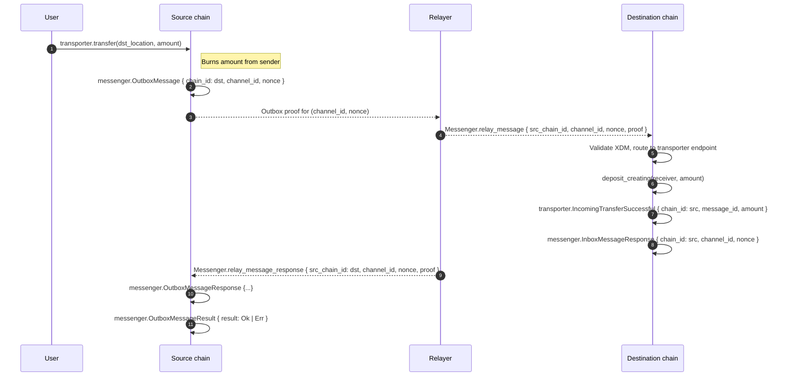

# Correlating Cross-domain Transfers Between Source and Destination Chains

This guide explains how to correlate a transfer initiated on a source chain with the corresponding deposit on the destination chain using Subspace Domains cross-domain messaging (XDM) and the transporter pallet.

## TL;DR

- The correlation key is the message ID: `message_id = (channel_id, nonce)`.
- Source chain events to capture:
  - transporter: `OutgoingTransferInitiated { chain_id: dst, message_id, amount }`
  - messenger: `OutboxMessage { chain_id: dst, channel_id, nonce }` → same `message_id`
- Destination chain events to confirm deposit:
  - transporter: `IncomingTransferSuccessful { chain_id: src, message_id, amount }`
  - messenger: `InboxMessageResponse { chain_id: src, channel_id, nonce }`
- Optional source-side acknowledgment after response relayed back:
  - messenger: `OutboxMessageResponse { ... }` and `OutboxMessageResult { result: Ok | Err }`

## Terminology & IDs

```rust
// domains/primitives/messenger/src/messages.rs
pub type Nonce = U256;                // monotonically increasing per channel
pub type MessageId = (ChannelId, Nonce); // correlation key across chains
pub type MessageKey = (ChainId, ChannelId, Nonce);

// domains/primitives/messenger/src/lib.rs
pub enum XdmId {
    RelayMessage(MessageKey),          // (src_chain_id, channel_id, nonce)
    RelayResponseMessage(MessageKey),  // (src_chain_id, channel_id, nonce)
}
```

## End-to-End Flow



## Events and Fields

- Source chain
  - transporter `OutgoingTransferInitiated { chain_id: dst_chain_id, message_id: (channel_id, nonce), amount }`
  - messenger `OutboxMessage { chain_id: dst_chain_id, channel_id, nonce }`
- Destination chain
  - transporter `IncomingTransferSuccessful { chain_id: src_chain_id, message_id: (channel_id, nonce), amount }`
  - messenger `InboxMessageResponse { chain_id: src_chain_id, channel_id, nonce }`
- Source chain (optional completion)
  - messenger `OutboxMessageResponse { chain_id: dst_chain_id, channel_id, nonce }`
  - messenger `OutboxMessageResult { chain_id, channel_id, nonce, result: Ok | Err }`

Notes:

- `message_id = (channel_id, nonce)` is identical across source and destination for the same transfer.
- In messenger events, `chain_id` denotes the counterparty chain for which the message/response is intended.

## Step-by-Step Correlation Procedure

1. From source transfer extrinsic (user call):
   - Capture `message_id` and `dst_chain_id` from `OutgoingTransferInitiated`.
   - Alternatively, derive `message_id` from messenger `OutboxMessage { channel_id, nonce }`.

2. On destination chain:
   - Look up `IncomingTransferSuccessful` with the same `message_id` and verify `amount`.
   - Optionally, also observe `InboxMessageResponse { channel_id, nonce }`.

3. Optional source-side completion:
   - When the response is relayed back, confirm `OutboxMessageResponse` and `OutboxMessageResult { Ok }` for the same `(channel_id, nonce)`.

### Example (pseudocode)

```text
// Given a source block containing transporter.transfer(...)
1. Scan source events:
   - Find OutgoingTransferInitiated → record dst_chain_id, message_id=(channel_id, nonce), amount

2. Scan destination blocks (>= time of relay):
   - Find IncomingTransferSuccessful where message_id matches → confirm amount & receiver
   - Optional: Find InboxMessageResponse with same (channel_id, nonce)

3. (Optional) Scan source for completion:
   - Find OutboxMessageResponse and OutboxMessageResult for (channel_id, nonce)
```

## Runtime APIs that help

Relayers and indexers can leverage the runtime API to compute correlation keys directly from extrinsics:

```rust
// Runtime: sp_messenger::MessengerApi::xdm_id(extrinsic) -> Option<XdmId>
// Returns (src_chain_id, channel_id, nonce) for relay_message / relay_message_response extrinsics.
fn xdm_id(ext: &Extrinsic) -> Option<XdmId> {
    match ext.function {
        RuntimeCall::Messenger(Call::relay_message { msg }) =>
            Some(XdmId::RelayMessage((msg.src_chain_id, msg.channel_id, msg.nonce))),
        RuntimeCall::Messenger(Call::relay_message_response { msg }) =>
            Some(XdmId::RelayResponseMessage((msg.src_chain_id, msg.channel_id, msg.nonce))),
        _ => None,
    }
}
```

## Where this is implemented (for reference)

- Messenger events and processing
  - `domains/pallets/messenger/src/lib.rs` (events, calls)
  - `domains/pallets/messenger/src/messages.rs` (inbox/outbox handling, response events)
- Transporter endpoint and deposit
  - `domains/pallets/transporter/src/lib.rs`
    - `transfer` extrinsic → burns on source; emits `OutgoingTransferInitiated`
    - Endpoint `finalize_transfer` on destination → `deposit_creating` and emits `IncomingTransferSuccessful`

## Practical tips

- Finality: Correlate using finalized blocks on both chains to avoid reorgs.
- Multiple channels: `channel_id` may change over time; always use `(channel_id, nonce)` from events for precise correlation.
- Indexing: Store `(src_chain_id, dst_chain_id, channel_id, nonce, amount, receiver)` to query either side efficiently.
